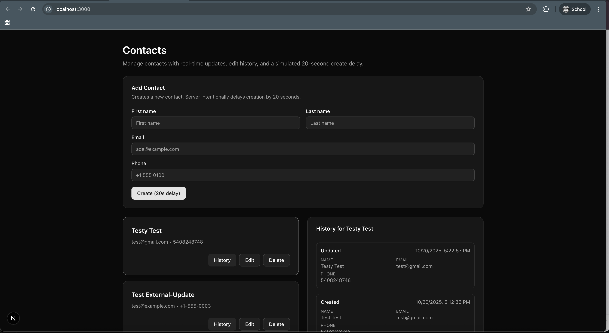
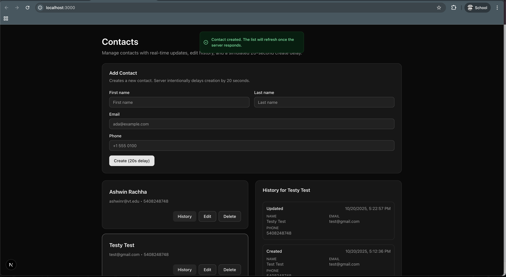

# Knot Contact API - Testing Documentation




## Overview

This document describes the complete testing setup for the Knot Contact API application, including Docker configuration, test suites, CI/CD pipeline, and validation procedures.

## Project Structure

```
knot-contact-api/
├── backend/                    # Django backend
│   ├── core/                   # Core application
│   │   ├── models.py          # Contact & ContactVersion models
│   │   ├── views.py           # API endpoints
│   │   ├── consumers.py       # WebSocket consumers
│   │   └── tests/             # Test suite
│   │       ├── test_contacts_api.py
│   │       ├── test_api_integration.py
│   │       └── test_websocket.py
│   ├── backend/               # Django settings
│   ├── requirements.txt       # Python dependencies
│   ├── pytest.ini            # Pytest configuration
│   └── Dockerfile            # Backend Docker image
├── frontend/                  # Next.js frontend
│   └── Dockerfile            # Frontend Docker image
├── docker-compose.yml        # Service orchestration
├── .github/workflows/ci.yml  # CI/CD pipeline
└── test_validation.sh        # Comprehensive validation script
```

## Features Implemented

### Backend (Django + DRF + Channels)
- ✅ CRUD operations for contacts
- ✅ Email uniqueness validation
- ✅ All fields mandatory validation
- ✅ Contact history tracking
- ✅ 20-second intentional delay on contact creation
- ✅ External update endpoint
- ✅ Real-time WebSocket updates
- ✅ CORS configuration
- ✅ Redis for WebSocket channel layer

### Frontend (Next.js)
- ✅ Dockerfile with multi-stage build
- ✅ Production-ready configuration

### Testing
- ✅ 20 comprehensive pytest tests
- ✅ Unit tests for API endpoints
- ✅ Integration tests
- ✅ WebSocket tests
- ✅ Validation tests
- ✅ History tracking tests

## Docker Setup

### Services

1. **Backend** (Django + Daphne)
   - Port: 8000
   - Automatic migrations on startup
   - Health checks configured
   - Volume mounted for development

2. **Frontend** (Next.js)
   - Port: 3000
   - Production build
   - Environment variables configured

3. **Redis**
   - Port: 6379
   - Used for WebSocket channel layer
   - Health checks configured

### Commands

```bash
# Build all services
docker-compose build

# Start all services
docker-compose up -d

# Stop all services
docker-compose down

# View logs
docker-compose logs -f

# Stop and remove volumes
docker-compose down -v
```

## Running Tests

### 1. Using Docker (Recommended)

```bash
# Run all tests except slow ones
docker-compose exec backend pytest -v -m "not slow"

# Run only unit tests
docker-compose exec backend pytest -v -m "unit"

# Run specific test file
docker-compose exec backend pytest -v core/tests/test_api_integration.py

# Run with coverage
docker-compose exec backend pytest --cov=core --cov-report=term -m "not slow"
```

### 2. Comprehensive Validation Script

```bash
# Make the script executable (first time only)
chmod +x test_validation.sh

# Run the validation script
./test_validation.sh
```

This script validates:
- Service health (Backend, Redis)
- Database migrations
- Complete CRUD operations
- Contact history tracking
- External updates
- Input validation
- Full pytest suite

## Test Suite Details

### Unit Tests (12 tests)
Located in `backend/core/tests/test_api_integration.py`:

**CRUD Operations:**
- `test_list_contacts` - List all contacts
- `test_create_contact` - Create new contact (mocks 20s delay)
- `test_retrieve_contact` - Get single contact
- `test_update_contact` - Update contact
- `test_partial_update_contact` - Partial update (PATCH)
- `test_delete_contact` - Delete contact

**Validation:**
- `test_email_uniqueness` - Duplicate email rejection
- `test_required_fields` - All fields mandatory
- `test_invalid_email_format` - Email format validation

**History Tracking:**
- `test_contact_history` - Version history retrieval

**External Updates:**
- `test_external_update` - External update endpoint
- `test_external_update_nonexistent_contact` - 404 handling

### Integration Tests (1 test - marked as slow)
- `test_contact_creation_delay` - Validates actual 20-second delay

### WebSocket Tests (5 tests)
Located in `backend/core/tests/test_websocket.py`:
- `test_websocket_connect` - WebSocket connection
- `test_websocket_receives_contact_created_event` - Create event broadcast
- `test_websocket_receives_contact_updated_event` - Update event broadcast
- `test_websocket_receives_contact_deleted_event` - Delete event broadcast
- `test_websocket_multiple_connections` - Multi-client broadcasting

### Existing Tests (2 tests)
Located in `backend/core/tests/test_contacts_api.py`:
- Basic contact creation with version
- Email uniqueness validation

## API Testing with curl

### List Contacts
```bash
curl -s http://localhost:8000/api/contacts/ | python3 -m json.tool
```

### Create Contact (20-second delay)
```bash
curl -X POST http://localhost:8000/api/contacts/ \
  -H 'Content-Type: application/json' \
  -d '{
    "first_name": "John",
    "last_name": "Doe",
    "email": "john@example.com",
    "phone": "+1-555-0001"
  }' | python3 -m json.tool
```

### Update Contact
```bash
curl -X PUT http://localhost:8000/api/contacts/1/ \
  -H 'Content-Type: application/json' \
  -d '{
    "first_name": "John",
    "last_name": "Smith",
    "email": "john@example.com",
    "phone": "+1-555-0002"
  }' | python3 -m json.tool
```

### Get Contact History
```bash
curl -s http://localhost:8000/api/contacts/1/history/ | python3 -m json.tool
```

### External Update
```bash
curl -X POST http://localhost:8000/api/external-update/ \
  -H 'Content-Type: application/json' \
  -d '{
    "id": 1,
    "first_name": "John",
    "last_name": "External",
    "email": "john@example.com",
    "phone": "+1-555-0003"
  }' | python3 -m json.tool
```

### Delete Contact
```bash
curl -X DELETE http://localhost:8000/api/contacts/1/
```

## CI/CD Pipeline

The GitHub Actions workflow (`.github/workflows/ci.yml`) runs on push and pull requests:

### Jobs

1. **test-backend**: Runs pytest tests in isolated environment
   - Sets up Python 3.12
   - Installs dependencies with caching
   - Runs migrations
   - Executes unit and integration tests

2. **test-integration**: Tests Docker deployment
   - Builds Docker images
   - Starts all services
   - Validates API endpoints
   - Ensures services communicate correctly

### Triggering CI

```bash
# Push to trigger CI
git add .
git commit -m "Your changes"
git push origin feature-contacts
```

## Troubleshooting

### Services won't start
```bash
# Check logs
docker-compose logs backend

# Rebuild from scratch
docker-compose down -v
docker-compose build --no-cache
docker-compose up -d
```

### Tests failing
```bash
# Check backend logs
docker-compose logs backend

# Run tests with more verbose output
docker-compose exec backend pytest -vv --tb=long

# Check if migrations are applied
docker-compose exec backend python manage.py showmigrations
```

### Port conflicts
```bash
# If ports 3000, 6379, or 8000 are in use
# Modify docker-compose.yml ports section
ports:
  - "8001:8000"  # Use different host port
```

## Performance Notes

- Contact creation intentionally takes 20 seconds (as per specification)
- In tests, `time.sleep` is mocked for speed
- Redis provides fast WebSocket message distribution
- SQLite used for development (consider PostgreSQL for production)

## Next Steps for Production

1. Replace SQLite with PostgreSQL
2. Add environment variable management
3. Set up proper secrets management
4. Configure production CORS settings
5. Add rate limiting
6. Set up monitoring and logging
7. Add authentication/authorization
8. Configure SSL/TLS certificates

## Contact

For questions or issues, please refer to the project repository.

## Knot Contact API

### Frontend and Backend Screenshots

#### 🖥️ Frontend


#### ⚙️ Backend

